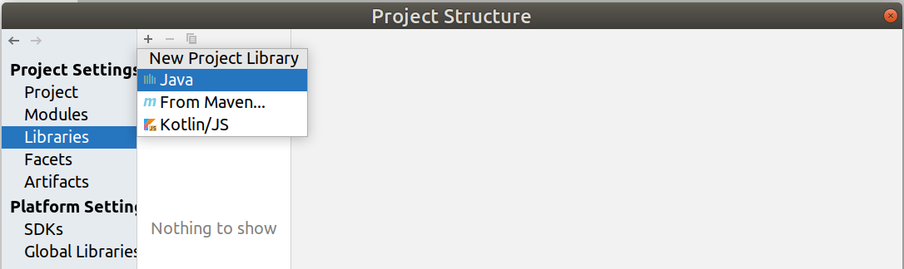
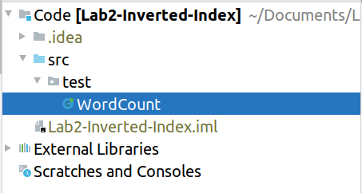
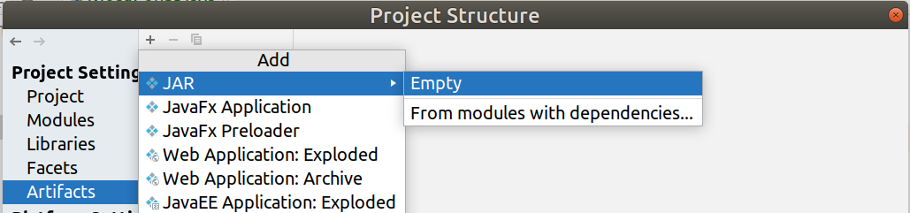
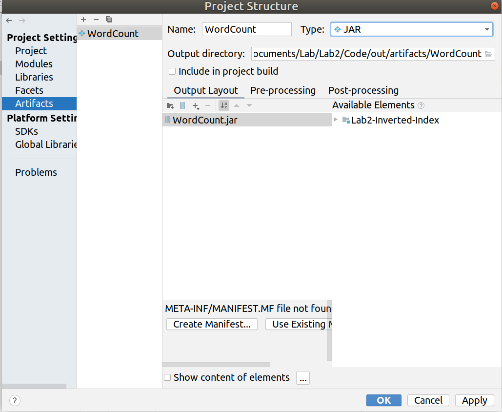
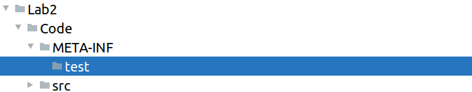
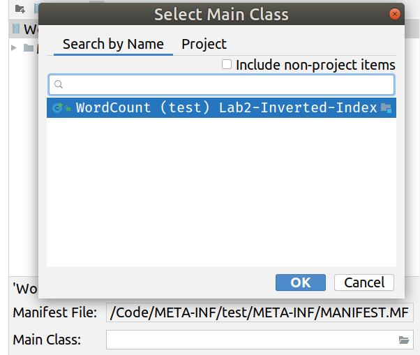
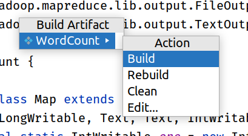
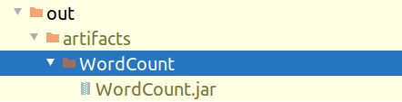
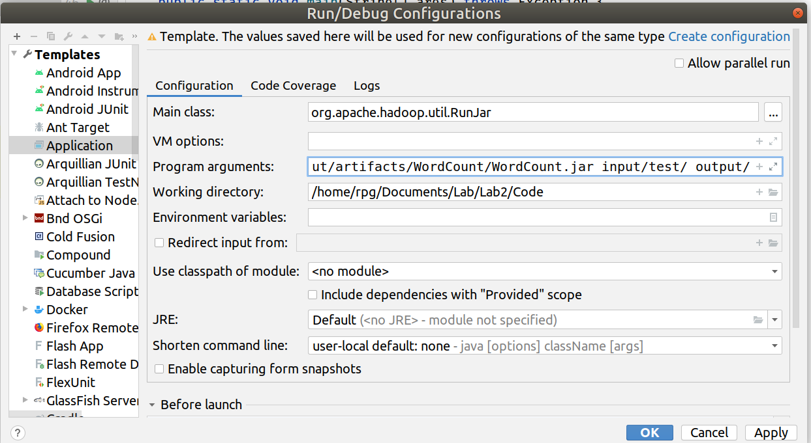
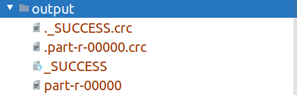

# IDEA & Hadoop配置方法

```wiki
参考如下的教程，应该可以完成所有的配置。
-----------------------------------------------
注意！
所有配置均在./Code/文件夹下进行，请勿污染根目录。
```


## 建立项目

1. 打开IntelliJ IDEA -> Create New Project，选择Java，注意`jdk版本为1.8`。

2. File -> Project Structure -> Libraries -> + -> Java，添加Hadoop的依赖。

   

   均位于${HADOOP_HOME}/share/hadoop/下，需要：

   - common
   - common/lib
   - mapreduce
   - mapreduce/lib
   - yarn


## 代码规划

1. 在`./src/[part]/`下编写相应的代码。

   其中，`[part]`为对应的部分，比如这里建立`./src/test/`用来存储测试类`WordCount`。

   

   *其中是Hadoop给出的官方WordCount代码。*

2. 此时文件的静态分析应该不报错，说明所有的包均引入成功。


## 生成JAR包

1. File -> Project Structure -> Artifacts -> + -> JAR -> Empty

   

2. 填写Name作为包的名字，选择输出路径（默认足够了），然后选择左下角的`Create Manifest`。

   

3. 对于选择`.MF文件`的路径，这里建议如下：

   

   在META-INF下创建一个与对应代码的`[part]`一致的文件夹，选择此文件夹。

   **这很重要！因为我们的程序可能涉及不止一个JAR包。**

   如此设置可以便于自己的管理。

4. 选择对应的MainClass。

   

5. 之后选择Build -> Build Artifacts，之后点击Build。

   

6. 结果如下：

   


## 测试文件布局

同样，建议在`Code目录`下进行如下布局：


不同[part]对应不同文件夹。


## 配置IDEA的Hadoop运行环境

1. Run -> Edit Configuration，在Template中选择Application，之后**Main Class要写org.apache.hadoop.util.RunJar。**

   之后在program arguments写入参数：`[jar] [input path] [output path]`

   再填写Working Directory。

   如下：

   

   保存。


## 运行

1. 运行如上配置的`RunJar`即可。

   **当出现将input path错误解度为output path时，注意检查主类是否是RunJar，有时候IDEA会抽风吞掉设置。**

2. 得到结果：

   